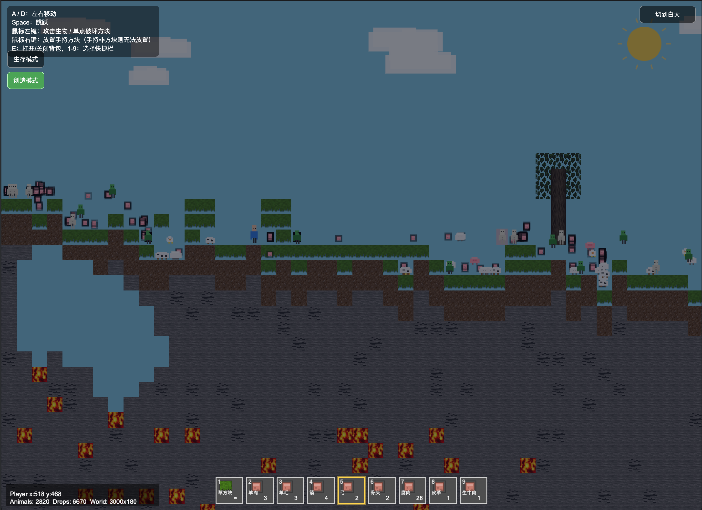

# Minecraft 2D Sandbox (Single-File Demo)

一个使用 **HTML + JavaScript + Canvas** 实现的 2D Minecraft-like 沙盒原型。\
项目坚持“**单文件、可直接测试、可读性优先**”原则，适合快速体验与教学演示。

> 💚 创作备注：这是一个痴迷《我的世界》的深圳三年级小学生（Ethan）完成的 Vibe Coding 作品。\
> 从想法到功能迭代，都以“边玩边做、边做边学”的方式持续打磨。

## 🖼️ 预览截图



***

## ✨ 特性概览

- 单文件架构：全部逻辑在 `index.html` 中，无打包依赖
- 大世界生成：`900 x 420` 区块，单区块大小 `32 x 32`
- 分层地形：空气 / 草 / 泥土 / 石头 / 基岩 / 虚空
- 矿物生成：煤、铁、金、钻石按概率生成
- 树木生成：多棵树随机生成（含树干和树叶）
- 玩家系统：移动、跳跃、重力、碰撞、摄像机跟随
- 生物系统：猪/牛/羊/鸡/鱼/乌贼 + 怪物（僵尸/骷髅/蜘蛛）高密度刷新
- 战斗系统：近战（僵尸）+ 远程投射物（弓箭），支持“箭互伤”（怪物也能误伤怪物）
- 掉落系统：击杀/击中掉落物，靠近自动拾取并进背包
- 方块交互：单点破坏、单点放置（放置以快捷栏所选方块为准）
- 背包与快捷栏：`E` 开关背包、`1-9` 切换快捷槽
- 合成系统：原木→木板、木板→工作台
- 生存机制：跌落伤害、卡住掉血、食物回血、血量归零重开
- 贴图渲染：方块/物品 UI/生物优先使用贴图，缺失自动回退到开源贴图/程序生成
- 原版贴图覆盖：支持从本机提取《我的世界》资源放入 `assets/vanilla/` 自动覆盖显示

***

## 🎮 操作说明

- `A / D`：左右移动
- `Space`：跳跃
- 鼠标左键：攻击生物 / 单点破坏方块
- 鼠标右键：
  - 若快捷栏当前选中的是弓：发射箭（生存模式消耗箭；创造模式不消耗）
  - 否则若快捷栏当前选中的是食物：优先食用并回血
  - 否则：单点放置快捷栏当前选中方块
- `E`：打开/关闭背包
- `1~9`：选择快捷栏对应槽位

***

## 🧩 核心玩法规则

### 1) 世界与地形

- 世界大小：`900 x 420`
- 方块大小：`32px`
- 主要地层：
  - 顶层空气
  - 草层、泥土层
  - 石头层（含矿物替换）
  - 基岩层
  - 更深处虚空

### 2) 方块与实体碰撞

- 玩家、动物与实体方块发生碰撞
- **树干可穿透**（玩家与动物都可穿过）
- 树叶仍可作为实体阻挡

### 3) 生物行为

- 生物种类：
  - 陆地：`pig / cow / sheep / chicken`
  - 海洋：`fish / squid`
  - 怪物：`zombie / skeleton / spider`
- 共同点：随机/追踪移动，受重力影响，碰撞后会掉头
- 条件跳跃：**仅在“坑里”或“台阶前”触发跳跃**
- 昼夜机制：夜晚刷怪更活跃；僵尸与骷髅在白天会持续掉血；蜘蛛夜晚刷新且可爬墙追击玩家

### 4) 血量与伤害

- 左上角爱心：`10` 颗，每颗代表 `2` 点血（总计 `20`）
- 动物卡在方块内：每秒掉 `5` 点
- 玩家卡在方块内：每秒掉 `4` 点
- 僵尸/骷髅白天：每秒掉 `2` 点
- 蜘蛛：`16` 血，近战攻击 `3` 点，击杀掉落蜘蛛丝与蜘蛛眼
- 玩家跌落伤害：
  - 跌落高度达到 `3` 格时扣 `1` 点
  - 每多 `1` 格，再多扣 `1` 点
  - **主动跳起后落地不扣血**
- 玩家血量 `<= 0`：立即重置游戏

### 5) 食物与回血

- 可食用：`raw_pork`、`mutton`、`raw_beef`
- 每次食用回复 `2` 点血
- 满血时不会消耗食物

***

## 🎒 背包、快捷栏与合成

### 背包

- 按 `E` 打开/关闭
- 支持物品计数显示
- 每个格子显示物品名称（超长名称会截断）

### 快捷栏

- 底部 9 宫格
- 可通过 `1~9` 选择当前槽位
- 右键食物优先从当前选中槽位读取

### 合成

- `1 原木 -> 4 木板`
- `4 木板 -> 1 工作台`

***

## 🚀 快速开始

### 方式一：直接打开

直接双击 `index.html` 即可运行。

### 方式二：本地 HTTP（推荐）

在项目目录执行：

```bash
python3 -m http.server 8000
```

浏览器访问：

```text
http://localhost:8000/
```

***

## 🧱 项目结构

```text
Minecraft-2D/
├── assets/
│   ├── textures/
│   │   └── tiles/    # 默认开源方块贴图（草/泥土/石头/矿物等）
│   └── vanilla/      # 可选：本机提取的原版贴图（被 .gitignore 忽略）
├── images/           # 仓库截图与文档图片
├── index.html   # 游戏全部实现（渲染/物理/世界生成/交互/UI）
├── LICENSE
└── README.md
```

***

## 🗺️ 后续可扩展方向

- 方块放置改为“按快捷栏所选物品”而非固定原石
- 掉落物磁吸、自动拾取动画、物品堆叠上限
- 生物 AI（巡逻半径、避障、寻路）
- 存档/读档（LocalStorage）
- 多配方工作台（2x2 / 3x3 体系）

***

## 🖼️ 贴图与资源

- `assets/textures/tiles/` 下的方块贴图来源于 Minetest Game（Luanti）项目的 `mods/default/textures`，媒体资源许可为 CC BY-SA 3.0（参考：`mods/default/README.txt` / `mods/default/license.txt`）。
- 本项目的代码仍按本仓库的 MIT License 发布；贴图文件按其各自许可使用。

### 使用《我的世界》原版贴图（本机提取）

项目支持“优先读取你自己电脑里提取的原版贴图”，放到本项目 `assets/vanilla/` 后会自动替换显示；如果某张图缺失，会自动回退到开源贴图/程序生成贴图，不会黑屏。

1) 找到并解压原版 jar（以 26.1.2 为例）

- 目录：`~/Library/Application Support/minecraft/versions/26.1.2/26.1.2.jar`
- 解压后在 jar 内找到：
  - `assets/minecraft/textures/block/`
  - `assets/minecraft/textures/item/`
  - `assets/minecraft/textures/entity/`

2) 复制到本项目（保持目录结构）

- 复制到：
  - `assets/vanilla/textures/block/`
  - `assets/vanilla/textures/item/`
  - `assets/vanilla/textures/entity/`

3) 建议先放入这些文件（最小可用）

- 方块（block）：
  - `grass_block_side.png`, `dirt.png`, `stone.png`, `sand.png`, `bedrock.png`
  - `oak_log.png`, `oak_leaves.png`, `oak_planks.png`, `crafting_table_side.png`
  - `coal_ore.png`, `iron_ore.png`, `gold_ore.png`, `diamond_ore.png`
  - `water_still.png`, `lava_still.png`
- 物品（item）：
  - `rotten_flesh.png`, `beef.png`, `porkchop.png`, `mutton.png`, `leather.png`, `ink_sac.png`, `cod.png`
  - `bone.png`, `bow.png`, `arrow.png`
  - `string.png`, `spider_eye.png`
- 生物（entity）（按原版目录拷贝）：
  - `pig/pig.png`, `cow/cow.png`, `sheep/sheep.png`, `chicken/chicken.png`
  - `zombie/zombie.png`, `skeleton/skeleton.png`, `spider/spider.png`
  - `squid/squid.png`, `fish/cod.png`

提示：`assets/vanilla/` 已被 `.gitignore` 忽略，避免把原版贴图误提交到仓库。

***

## 📄 License

本项目使用 [MIT License](./LICENSE)。
